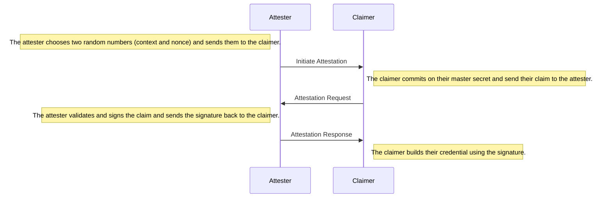

# Attestation

Before the attester can sign the claimer's credential, they have to have initiate the attestation session by generating a nonce which will prevent replay attacks.
After the claim has been sent to the attester, they sign it and send the signature over to the claimer.
Then, the claimer can build their credential using the claim and the attester's signature.



Before an attester can create attestations, they have to generate a key pair and publish their public key.

```js
const portablegabi = require("@kiltprotocol/portablegabi");
// Build a new attester.
// Note: generating a new key pair will take around 10-30 minutes.
// const attester = await portablegabi.Attester.create(365, 70)

// For this example you could use the provided keys.
// Note: never use those keys in production!!!
const pubKey = new portablegabi.AttesterPublicKey(
  "<The pre-generated public key of the attester>"
);
const privKey = new portablegabi.AttesterPrivateKey(
  "<The pre-generated private key of the attester>"
);
const attester = new portablegabi.Attester(pubKey, privKey);

// Create a new accumulator (which is used for revocation).
let accumulator = await attester.createAccumulator();
console.log("Accumulator:\n\t", accumulator.toString()());

// Build a new claimer and generate a new master key.
// const claimer = await portablegabi.Claimer.create()
// or use a mnemonic:
const claimer = await portablegabi.Claimer.buildFromMnemonic(
  "siege decrease quantum control snap ride position strategy fire point airport include"
);

// The attester initiates the attestation session.
const {
  message: startAttestationMsg,
  session: attestationSession,
} = await attester.startAttestation();

// The claimer answers with an attestation request.
const claim = {
  age: 15,
  name: "George",
};

const {
  message: attestationRequest,
  session: claimerSession,
} = await claimer.requestAttestation({
  // The received attestation message.
  startAttestationMsg,
  // The claim which should get attested.
  claim,
  // The public key of the attester.
  attesterPubKey: attester.publicKey,
});

// The attester should check the claim they are about to attest.
const receivedClaim = attestationRequest.getClaim();
console.log("Claim built from attestation\n\t", receivedClaim);

// Do checks on receivedClaim.
// If everything checks out the attester issues an attestation.
const {
  // The attestation should be sent over to the claimer.
  attestation,
  // The witness should be stored for later revocation.
  witness,
} = await attester.issueAttestation({
  attestationSession,
  attestationRequest,
  // The update is used to generate a non-revocation witness.
  accumulator,
});
console.log("Witness:\n\t", witness.toString()());

// After the claimer has received their attestation, they can build their credential.
const credential = await claimer.buildCredential({
  claimerSession,
  attestation,
});
console.log("Credential:\n\t", credential.toString()());
```

Upon completion of an attestation session, the attester receives a _witness_ which can be used to revoke the attestation and the claimer receives a credential with which they can generate presentations for an arbitrary amount of verifiers.
Note that an attester should store each witness and keep track of the matching claim.
