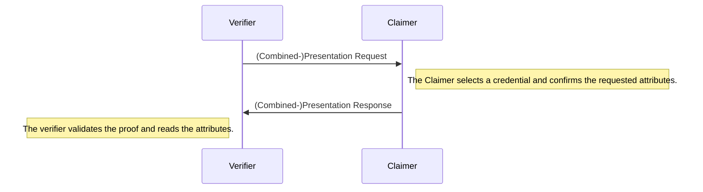

# Verification

During the verification, the verifier requests a set of attributes from the claimer.
The claimer discloses their attributes and provides a proof (referred to as presentation).
The verifier can then validate that the attributes are signed by a trusted attester using the claimer's presentation.



The claimer is required to have both a credential and the public key of the attester who signed it.
On the other hand, the verifier needs to trust the attester who signed the credential and their latest accumulator.

### Accumulator timestamps

However, new versions of accumulators could be added to the chain quite frequently.
The worst case would be, that the claimer needs to update their credential before every verification.
To prevent this, **a verifier can signal the claimer that they accept not only the newest accumulator, but also accumulators which are more recent than a specified point in time**. This timestamp is set using the `reqUpdatedAfter` parameter.

If the verifier sends the current time, the claimer most likely has to check for the newest accumulator.
During the verification, the verifier needs to decide on a latest accumulator.
This is done using the `latestAccumulator` parameter.
If the claimer sends a newer accumulator than `latestAccumulator`, the verifier accepts this accumulator automatically as it's timestamp is greater than the required one.

In short: **the verifier accepts an accumulator if it is newer than the newest accumulator they know of** or **if it was created after `reqUpdatedAfter`**.

For more details about the accumulator, have a look at the next [section](./4_revocation.md).

## Example

```js
const portablegabi = require("@kiltprotocol/portablegabi");

const claimer = await portablegabi.Claimer.buildFromMnemonic(
  "siege decrease quantum control snap ride position strategy fire point airport include"
);

const credential = new portablegabi.Credential(
  "<The credential created during the attestation>"
);
const accumulator = new portablegabi.Accumulator(
  "<The accumulator created during the attestation>"
);
const pubKey = new portablegabi.AttesterPublicKey(
  "<The pre-generated public key of the attester>"
);

// The verifier requests a presentation.
const {
  // Local information used to verify the presentation later.
  session: verifierSession,
  // The request which should be sent to the claimer containing the requested attributes.
  message: presentationReq,
} = await portablegabi.Verifier.requestPresentation({
  // Specify which attributes should be disclosed.
  requestedAttributes: ["age"],
  // The threshold for the age of the accumulator.
  // If the accumulator was created before this date, the proof will be rejected
  // except if the accumulator is the newest available accumulator.
  reqUpdatedAfter: new Date(),
});

// After the claimer has received the presentationRequest, they build a presentation:
const presentation = await claimer.buildPresentation({
  credential,
  presentationReq,
  attesterPubKey: pubKey,
});
console.log("Presentation:\n\t", presentation.toString()());

// The presentation is sent over to the verifier who validates the proof and extracts the claim.
const {
  // The contained claim, this value is undefined if the proof could not be validated.
  claim: publicClaim,
  // A boolean which indicates whether the presentation was valid.
  verified,
} = await portablegabi.Verifier.verifyPresentation({
  // The presentation which was sent over by the claimer.
  proof: presentation,
  verifierSession,
  // The public key which was used by the attester to sign the credential.
  attesterPubKey: pubKey,
  // This accumulator is used to check whether the claimer provided the newest available accumulator.
  latestAccumulator: accumulator,
});
console.log("Public claim:\n\t", publicClaim);
console.log("Verified?", verified);
```
